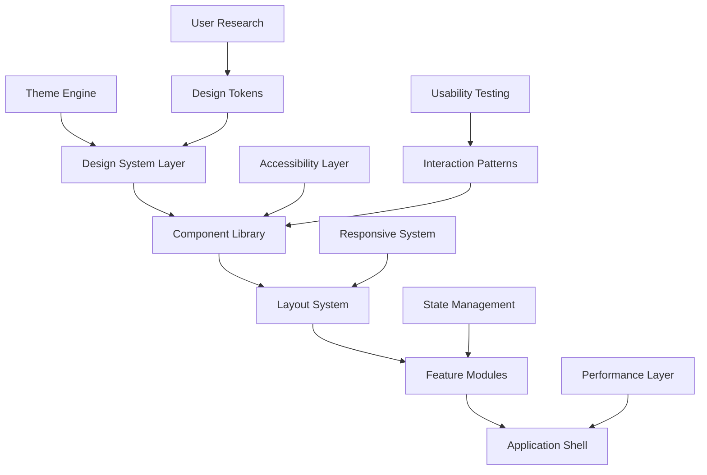
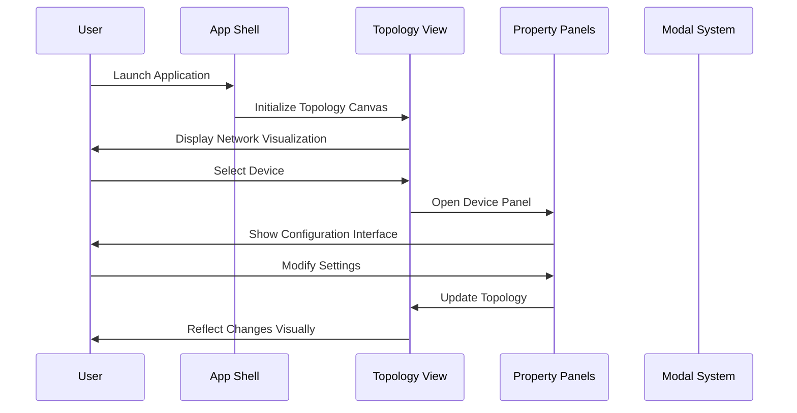

# Design Document: UI/UX Full Modernization

## Overview

This design document outlines a comprehensive modernization of the network topology application's user interface and user experience. The current application is a sophisticated network simulation tool with components for device management, terminal interfaces, configuration panels, and visual topology editing. The modernization will transform the interface into a contemporary, accessible, and highly usable application while preserving all existing functionality and enhancing performance.

The modernization focuses on creating a cohesive design system, improving information architecture, enhancing mobile responsiveness, implementing modern interaction patterns, and establishing a scalable component architecture that supports future growth.

## Architecture

The modernized UI/UX will follow a layered architecture with clear separation of concerns:



### Main User Flow Architecture



## Components and Interfaces

### Core Design System Components

#### 1. Design Tokens

```typescript
interface DesignTokens {
  colors: {
    primary: ColorScale;
    secondary: ColorScale;
    accent: ColorScale;
    semantic: SemanticColors;
    surface: SurfaceColors;
  };
  typography: {
    fontFamilies: FontFamilyTokens;
    fontSizes: FontSizeScale;
    lineHeights: LineHeightScale;
    fontWeights: FontWeightScale;
  };
  spacing: SpacingScale;
  borderRadius: RadiusScale;
  shadows: ShadowScale;
  animations: AnimationTokens;
}

interface ColorScale {
  50: string;
  100: string;
  200: string;
  300: string;
  400: string;
  500: string; // Base color
  600: string;
  700: string;
  800: string;
  900: string;
  950: string;
}

interface SemanticColors {
  success: ColorScale;
  warning: ColorScale;
  error: ColorScale;
  info: ColorScale;
}
```

#### 2. Component Architecture

```typescript
interface ModernizedComponent {
  // Visual Design
  appearance: ComponentAppearance;
  variants: ComponentVariants;
  states: ComponentStates;
  
  // Interaction Design
  gestures: SupportedGestures;
  feedback: FeedbackMechanisms;
  accessibility: AccessibilityFeatures;
  
  // Responsive Design
  breakpoints: ResponsiveBreakpoints;
  adaptiveLayout: AdaptiveLayoutRules;
  
  // Performance
  optimization: PerformanceOptimizations;
  lazyLoading: LazyLoadingStrategy;
}

interface ComponentAppearance {
  surface: SurfaceStyle;
  elevation: ElevationLevel;
  borders: BorderStyle;
  typography: TypographyStyle;
  iconography: IconStyle;
}
```

### Modernized Application Shell

#### Navigation System

```typescript
interface ModernNavigationSystem {
  primary: {
    type: 'sidebar' | 'top-bar' | 'hybrid';
    collapsible: boolean;
    adaptive: boolean;
    items: NavigationItem[];
  };
  secondary: {
    type: 'tabs' | 'breadcrumbs' | 'contextual';
    position: 'top' | 'bottom' | 'inline';
    items: SecondaryNavigationItem[];
  };
  mobile: {
    type: 'bottom-tabs' | 'hamburger' | 'gesture-based';
    overlay: boolean;
    items: MobileNavigationItem[];
  };
}

interface NavigationItem {
  id: string;
  label: string;
  icon: IconComponent;
  route: string;
  badge?: BadgeConfig;
  children?: NavigationItem[];
  permissions?: string[];
}
```

#### Layout System

```typescript
interface ModernLayoutSystem {
  grid: {
    columns: number;
    gutters: SpacingToken;
    margins: SpacingToken;
    breakpoints: BreakpointConfig;
  };
  regions: {
    header: LayoutRegion;
    sidebar: LayoutRegion;
    main: LayoutRegion;
    footer: LayoutRegion;
    overlay: LayoutRegion;
  };
  responsive: {
    strategy: 'mobile-first' | 'desktop-first';
    breakpoints: ResponsiveBreakpoints;
    adaptations: LayoutAdaptations;
  };
}
```

### Enhanced Topology Canvas

#### Modern Canvas Interface

```typescript
interface ModernTopologyCanvas {
  // Visual Enhancements
  rendering: {
    engine: 'svg' | 'canvas' | 'webgl';
    antialiasing: boolean;
    highDPI: boolean;
    animations: AnimationConfig;
  };
  
  // Interaction Improvements
  gestures: {
    pan: PanGestureConfig;
    zoom: ZoomGestureConfig;
    select: SelectionGestureConfig;
    multitouch: MultitouchConfig;
  };
  
  // Accessibility Features
  accessibility: {
    screenReader: ScreenReaderSupport;
    keyboard: KeyboardNavigation;
    highContrast: HighContrastMode;
    focusManagement: FocusManagementConfig;
  };
  
  // Performance Optimizations
  performance: {
    virtualization: VirtualizationConfig;
    levelOfDetail: LODConfig;
    culling: CullingConfig;
    batching: BatchingConfig;
  };
}

interface DeviceVisualization {
  // Enhanced Visual Design
  appearance: {
    style: 'realistic' | 'schematic' | 'minimal';
    theme: 'light' | 'dark' | 'auto';
    customization: CustomizationOptions;
  };
  
  // Interactive States
  states: {
    idle: DeviceState;
    hover: DeviceState;
    selected: DeviceState;
    active: DeviceState;
    disabled: DeviceState;
    error: DeviceState;
  };
  
  // Animation System
  animations: {
    transitions: TransitionConfig;
    feedback: FeedbackAnimations;
    status: StatusAnimations;
  };
}
```

### Modernized Panel System

#### Unified Panel Architecture

```typescript
interface ModernPanelSystem {
  // Panel Types
  types: {
    inspector: InspectorPanel;
    configuration: ConfigurationPanel;
    terminal: TerminalPanel;
    properties: PropertiesPanel;
    tools: ToolsPanel;
  };
  
  // Layout Management
  layout: {
    docking: DockingSystem;
    resizing: ResizingBehavior;
    stacking: StackingBehavior;
    persistence: LayoutPersistence;
  };
  
  // Responsive Behavior
  responsive: {
    mobile: MobilePanelBehavior;
    tablet: TabletPanelBehavior;
    desktop: DesktopPanelBehavior;
  };
}

interface EnhancedTerminalInterface {
  // Modern Terminal Design
  appearance: {
    theme: TerminalTheme;
    typography: MonospaceTypography;
    colorScheme: TerminalColorScheme;
    transparency: OpacityLevel;
  };
  
  // Enhanced Functionality
  features: {
    autocompletion: AutocompletionConfig;
    syntax: SyntaxHighlighting;
    history: CommandHistory;
    search: SearchCapabilities;
    export: ExportOptions;
  };
  
  // Accessibility
  accessibility: {
    screenReader: TerminalScreenReaderSupport;
    keyboard: TerminalKeyboardShortcuts;
    fontSize: FontSizeScaling;
    contrast: ContrastOptions;
  };
}
```

## Data Models

### Enhanced State Management

```typescript
interface ModernApplicationState {
  // UI State
  ui: {
    theme: ThemeState;
    layout: LayoutState;
    panels: PanelState;
    modals: ModalState;
    notifications: NotificationState;
  };
  
  // User Preferences
  preferences: {
    accessibility: AccessibilityPreferences;
    appearance: AppearancePreferences;
    behavior: BehaviorPreferences;
    shortcuts: ShortcutPreferences;
  };
  
  // Application Data
  data: {
    topology: TopologyState;
    devices: DeviceState;
    connections: ConnectionState;
    configurations: ConfigurationState;
  };
  
  // Performance Metrics
  performance: {
    rendering: RenderingMetrics;
    interactions: InteractionMetrics;
    memory: MemoryMetrics;
  };
}

interface ThemeState {
  current: 'light' | 'dark' | 'auto' | 'high-contrast';
  customizations: ThemeCustomizations;
  systemPreference: boolean;
  transitions: ThemeTransitionConfig;
}

interface AccessibilityPreferences {
  screenReader: boolean;
  reducedMotion: boolean;
  highContrast: boolean;
  fontSize: FontSizePreference;
  keyboardNavigation: boolean;
  focusIndicators: FocusIndicatorPreference;
}
```

### Component State Models

```typescript
interface ComponentStateModel {
  // Visual State
  visual: {
    variant: ComponentVariant;
    size: ComponentSize;
    color: ComponentColor;
    disabled: boolean;
    loading: boolean;
  };
  
  // Interaction State
  interaction: {
    focused: boolean;
    hovered: boolean;
    pressed: boolean;
    selected: boolean;
    dragging: boolean;
  };
  
  // Data State
  data: {
    value: ComponentValue;
    validation: ValidationState;
    dirty: boolean;
    pristine: boolean;
  };
  
  // Animation State
  animation: {
    entering: boolean;
    exiting: boolean;
    transitioning: boolean;
    duration: number;
  };
}
```

## Algorithmic Pseudocode

### Main UI Initialization Algorithm

```pascal
ALGORITHM initializeModernUI()
INPUT: applicationConfig, userPreferences
OUTPUT: initializedUIState

BEGIN
  // Initialize design system
  designSystem ← loadDesignSystem(applicationConfig.theme)
  
  // Setup accessibility
  accessibility ← initializeAccessibility(userPreferences.accessibility)
  
  // Initialize responsive system
  responsive ← setupResponsiveSystem(designSystem.breakpoints)
  
  // Create component registry
  components ← registerComponents(designSystem, accessibility)
  
  // Setup layout system
  layout ← initializeLayout(responsive, userPreferences.layout)
  
  // Initialize state management
  state ← createStateManager(userPreferences)
  
  // Setup performance monitoring
  performance ← initializePerformanceMonitoring()
  
  // Create application shell
  shell ← createApplicationShell(layout, components, state)
  
  // Initialize feature modules
  FOR each module IN applicationConfig.modules DO
    moduleInstance ← initializeModule(module, components, state)
    shell.registerModule(moduleInstance)
  END FOR
  
  // Setup event system
  events ← initializeEventSystem(shell, performance)
  
  // Apply initial theme
  applyTheme(designSystem, userPreferences.theme)
  
  // Start performance monitoring
  performance.start()
  
  RETURN createUIState(shell, components, state, performance)
END
```

### Responsive Layout Algorithm

```pascal
ALGORITHM calculateResponsiveLayout(viewport, components, preferences)
INPUT: viewport dimensions, component list, user preferences
OUTPUT: optimized layout configuration

BEGIN
  // Determine breakpoint
  breakpoint ← determineBreakpoint(viewport.width)
  
  // Calculate available space
  availableSpace ← calculateAvailableSpace(viewport, preferences.margins)
  
  // Initialize layout grid
  grid ← createLayoutGrid(breakpoint, availableSpace)
  
  // Sort components by priority
  sortedComponents ← sortByPriority(components, breakpoint)
  
  // Allocate space for each component
  layout ← createEmptyLayout()
  
  FOR each component IN sortedComponents DO
    // Calculate component requirements
    requirements ← calculateComponentRequirements(component, breakpoint)
    
    // Find optimal position
    position ← findOptimalPosition(grid, requirements, layout)
    
    IF position IS valid THEN
      // Place component
      layout.placeComponent(component, position)
      grid.markOccupied(position, requirements.size)
    ELSE
      // Handle overflow (stack, hide, or resize)
      handleComponentOverflow(component, layout, breakpoint)
    END IF
  END FOR
  
  // Optimize layout for accessibility
  layout ← optimizeForAccessibility(layout, preferences.accessibility)
  
  // Apply responsive adjustments
  layout ← applyResponsiveAdjustments(layout, breakpoint)
  
  RETURN layout
END
```

### Theme Transition Algorithm

```pascal
ALGORITHM transitionTheme(currentTheme, targetTheme, preferences)
INPUT: current theme state, target theme, user preferences
OUTPUT: theme transition plan

BEGIN
  // Check if transition is needed
  IF currentTheme.id = targetTheme.id THEN
    RETURN noTransitionNeeded()
  END IF
  
  // Calculate theme differences
  differences ← calculateThemeDifferences(currentTheme, targetTheme)
  
  // Determine transition strategy
  strategy ← determineTransitionStrategy(differences, preferences.animations)
  
  // Create transition timeline
  timeline ← createTransitionTimeline(strategy, differences)
  
  // Prepare components for transition
  FOR each component IN getVisibleComponents() DO
    component.prepareForThemeTransition(targetTheme)
  END FOR
  
  // Execute transition
  IF preferences.reducedMotion THEN
    // Instant transition for accessibility
    applyThemeInstantly(targetTheme)
  ELSE
    // Animated transition
    executeAnimatedTransition(timeline, targetTheme)
  END IF
  
  // Update system preferences if needed
  IF targetTheme.followsSystem THEN
    updateSystemThemePreference(targetTheme)
  END IF
  
  // Persist theme choice
  persistThemePreference(targetTheme, preferences)
  
  RETURN transitionComplete(targetTheme)
END
```

### Accessibility Enhancement Algorithm

```pascal
ALGORITHM enhanceAccessibility(component, preferences, context)
INPUT: UI component, accessibility preferences, usage context
OUTPUT: accessibility-enhanced component

BEGIN
  enhanced ← cloneComponent(component)
  
  // Add ARIA attributes
  IF component.type = 'interactive' THEN
    enhanced.addARIARole(determineARIARole(component))
    enhanced.addARIALabel(generateAccessibleLabel(component, context))
    enhanced.addARIADescription(generateDescription(component))
  END IF
  
  // Enhance keyboard navigation
  IF preferences.keyboardNavigation THEN
    enhanced.addKeyboardHandlers(generateKeyboardHandlers(component))
    enhanced.setTabIndex(calculateTabIndex(component, context))
  END IF
  
  // Add focus management
  enhanced.addFocusManagement(createFocusManagement(component, context))
  
  // Enhance for screen readers
  IF preferences.screenReader THEN
    enhanced.addScreenReaderSupport(generateScreenReaderContent(component))
    enhanced.addLiveRegions(determineLiveRegions(component))
  END IF
  
  // Apply high contrast if needed
  IF preferences.highContrast THEN
    enhanced.applyHighContrastStyling(generateHighContrastStyles(component))
  END IF
  
  // Add reduced motion support
  IF preferences.reducedMotion THEN
    enhanced.disableAnimations()
    enhanced.addInstantFeedback(generateInstantFeedback(component))
  END IF
  
  // Validate accessibility compliance
  validation ← validateAccessibility(enhanced, preferences)
  
  IF NOT validation.isCompliant THEN
    enhanced ← fixAccessibilityIssues(enhanced, validation.issues)
  END IF
  
  RETURN enhanced
END
```

## Key Functions with Formal Specifications

### Function 1: renderModernComponent()

```typescript
function renderModernComponent(
  component: ComponentDefinition,
  props: ComponentProps,
  context: RenderContext
): RenderedComponent
```

**Preconditions:**
- `component` is a valid component definition with required properties
- `props` conform to the component's prop schema
- `context` contains valid theme, accessibility, and layout information
- Component is registered in the component registry

**Postconditions:**
- Returns a fully rendered component with modern styling applied
- Component includes all accessibility enhancements
- Component is responsive and adapts to current breakpoint
- All animations and interactions are properly configured
- Performance optimizations are applied

**Loop Invariants:** N/A (no loops in this function)

### Function 2: calculateOptimalLayout()

```typescript
function calculateOptimalLayout(
  components: ComponentList,
  viewport: ViewportDimensions,
  constraints: LayoutConstraints
): LayoutConfiguration
```

**Preconditions:**
- `components` is a non-empty array of valid component definitions
- `viewport` has positive width and height values
- `constraints` contains valid layout rules and preferences
- All components have defined size requirements

**Postconditions:**
- Returns a layout configuration that fits within viewport constraints
- All high-priority components are positioned optimally
- Layout respects accessibility requirements (focus order, spacing)
- No components overlap unless explicitly allowed
- Layout is optimized for the current breakpoint

**Loop Invariants:**
- For component placement loop: All previously placed components remain in valid positions
- Available space calculations remain consistent throughout iteration
- Component priority ordering is maintained

### Function 3: applyThemeTransition()

```typescript
function applyThemeTransition(
  fromTheme: ThemeDefinition,
  toTheme: ThemeDefinition,
  options: TransitionOptions
): Promise<TransitionResult>
```

**Preconditions:**
- `fromTheme` and `toTheme` are valid theme definitions
- `options` contains valid transition preferences
- No other theme transition is currently in progress
- All components support theme transitions

**Postconditions:**
- Theme transition completes successfully or fails gracefully
- All components reflect the new theme consistently
- User preferences are updated and persisted
- Performance metrics are recorded
- Accessibility preferences are respected during transition

**Loop Invariants:**
- For component update loop: All updated components maintain visual consistency
- Theme application progress is monotonically increasing
- No component is left in an intermediate theme state

## Example Usage

### Basic Component Usage

```typescript
// Modern Button Component
const ModernButton = () => (
  <Button
    variant="primary"
    size="medium"
    accessibility={{
      label: "Save network configuration",
      description: "Saves the current network topology and device settings"
    }}
    animation={{
      hover: "subtle-lift",
      press: "gentle-scale",
      focus: "glow-ring"
    }}
    responsive={{
      mobile: { size: "large", fullWidth: true },
      tablet: { size: "medium" },
      desktop: { size: "medium" }
    }}
  >
    Save Configuration
  </Button>
);

// Enhanced Topology Canvas
const ModernTopologyCanvas = () => (
  <TopologyCanvas
    rendering={{
      engine: "svg",
      antialiasing: true,
      highDPI: true
    }}
    interactions={{
      gestures: ["pan", "zoom", "select", "multiselect"],
      keyboard: true,
      accessibility: true
    }}
    performance={{
      virtualization: true,
      levelOfDetail: true,
      batching: true
    }}
    theme="adaptive"
  />
);
```

### Layout System Usage

```typescript
// Responsive Layout Configuration
const modernLayout = {
  breakpoints: {
    mobile: { max: 640 },
    tablet: { min: 641, max: 1024 },
    desktop: { min: 1025 }
  },
  
  regions: {
    header: {
      height: { mobile: 60, tablet: 70, desktop: 80 },
      sticky: true,
      zIndex: 100
    },
    
    sidebar: {
      width: { mobile: 0, tablet: 280, desktop: 320 },
      collapsible: true,
      overlay: { mobile: true, tablet: false, desktop: false }
    },
    
    main: {
      padding: { mobile: 16, tablet: 24, desktop: 32 },
      maxWidth: { desktop: 1400 }
    }
  }
};

// Theme Configuration
const modernTheme = {
  colors: {
    primary: {
      50: "#eff6ff",
      500: "#3b82f6",
      900: "#1e3a8a"
    },
    semantic: {
      success: "#10b981",
      warning: "#f59e0b",
      error: "#ef4444",
      info: "#06b6d4"
    }
  },
  
  typography: {
    fontFamily: {
      sans: ["Inter", "system-ui", "sans-serif"],
      mono: ["JetBrains Mono", "Consolas", "monospace"]
    },
    fontSize: {
      xs: "0.75rem",
      sm: "0.875rem",
      base: "1rem",
      lg: "1.125rem",
      xl: "1.25rem"
    }
  },
  
  animations: {
    duration: {
      fast: "150ms",
      normal: "300ms",
      slow: "500ms"
    },
    easing: {
      ease: "cubic-bezier(0.4, 0, 0.2, 1)",
      bounce: "cubic-bezier(0.68, -0.55, 0.265, 1.55)"
    }
  }
};
```

## Correctness Properties

*A property is a characteristic or behavior that should hold true across all valid executions of a system-essentially, a formal statement about what the system should do. Properties serve as the bridge between human-readable specifications and machine-verifiable correctness guarantees.*

### Property 1: Design System Consistency

*For any* design token update, all consuming components should reflect the change automatically and maintain visual consistency across all themes and breakpoints.

**Validates: Requirements 1.1, 1.2, 1.5**

### Property 2: Universal Accessibility Compliance

*For any* UI component, it should meet WCAG 2.1 AA standards, provide proper ARIA attributes, and support keyboard navigation and screen readers.

**Validates: Requirements 2.1, 2.2, 2.3, 2.4**

### Property 3: Responsive Adaptation

*For any* viewport size change, the interface should adapt appropriately to maintain optimal usability across mobile, tablet, and desktop breakpoints.

**Validates: Requirements 3.1, 3.2, 3.4**

### Property 4: Touch Interaction Support

*For any* touch-enabled device, the application should provide touch-optimized interactions and gesture-based navigation options.

**Validates: Requirements 3.3, 3.5**

### Property 5: Navigation System Completeness

*For any* user workflow, the navigation system should provide complete access to all functionality through primary, secondary, and contextual navigation elements.

**Validates: Requirements 4.1, 4.3, 4.4, 4.5**

### Property 6: Canvas Interaction Responsiveness

*For any* topology canvas interaction, the system should provide immediate visual feedback within 100ms and maintain smooth 60 FPS performance.

**Validates: Requirements 5.1, 5.2, 8.1, 8.2**

### Property 7: Multi-Selection Operations

*For any* multi-device selection on the topology canvas, bulk operations and alignment tools should be available and functional.

**Validates: Requirements 5.5, 5.6**

### Property 8: Panel System Adaptability

*For any* screen size or device type, the panel system should adapt layouts appropriately and persist user preferences across sessions.

**Validates: Requirements 6.2, 6.3, 6.5**

### Property 9: Terminal Interface Enhancement

*For any* terminal command input, the interface should provide syntax highlighting, autocompletion, and maintain command history with search capabilities.

**Validates: Requirements 7.1, 7.2, 7.3**

### Property 10: Performance Threshold Compliance

*For any* user interaction or application load, performance metrics should meet specified thresholds (100ms response, 60 FPS, 3s load time).

**Validates: Requirements 8.1, 8.2, 8.4**

### Property 11: Theme System Consistency

*For any* theme change, all components should update consistently and transitions should be smooth when animations are enabled.

**Validates: Requirements 9.1, 9.3, 9.5**

### Property 12: State Management Reliability

*For any* application state change, the system should automatically persist changes and restore state correctly across sessions.

**Validates: Requirements 10.1, 10.2, 10.3**

### Property 13: Animation System Responsiveness

*For any* user interaction, the animation system should provide immediate feedback while respecting reduced motion preferences.

**Validates: Requirements 11.1, 11.2, 11.3**

### Property 14: Component API Consistency

*For any* component in the library, it should follow consistent API patterns and maintain backward compatibility when updated.

**Validates: Requirements 12.1, 12.2, 12.4**

### Property 15: Error Handling Completeness

*For any* error condition, the system should provide user-friendly messages, detailed logging, and graceful degradation or recovery options.

**Validates: Requirements 13.1, 13.2, 13.4, 13.5**

### Property 16: Security Input Validation

*For any* user input, the security layer should sanitize data to prevent XSS attacks and validate configuration data before processing.

**Validates: Requirements 14.1, 14.3**

### Property 17: Testing Coverage Compliance

*For any* UI component modification, automated tests should run to ensure 90% code coverage and accessibility compliance.

**Validates: Requirements 15.1, 15.2**

## Error Handling

### Error Scenario 1: Theme Loading Failure

**Condition**: When a theme fails to load due to network issues or corrupted theme data
**Response**: Fall back to default theme, log error, show user notification
**Recovery**: Retry theme loading, allow manual theme selection, persist fallback choice

### Error Scenario 2: Component Rendering Failure

**Condition**: When a component fails to render due to invalid props or system errors
**Response**: Render error boundary component, log detailed error information
**Recovery**: Attempt component re-render, provide alternative component, maintain application stability

### Error Scenario 3: Layout Calculation Overflow

**Condition**: When layout calculations result in components that don't fit in available space
**Response**: Apply overflow handling strategy (stack, hide, or resize components)
**Recovery**: Recalculate layout with adjusted constraints, provide scrolling or pagination

### Error Scenario 4: Accessibility Feature Failure

**Condition**: When accessibility features fail to initialize or function properly
**Response**: Ensure basic accessibility remains functional, log accessibility errors
**Recovery**: Reinitialize accessibility features, provide alternative accessible interfaces

## Testing Strategy

### Unit Testing Approach

**Component Testing**: Each modernized component will have comprehensive unit tests covering:
- Rendering with various prop combinations
- Accessibility compliance verification
- Responsive behavior validation
- Theme application correctness
- Event handling and user interactions

**Coverage Goals**: Minimum 90% code coverage for all UI components and utilities

### Property-Based Testing Approach

**Property Test Library**: fast-check (for TypeScript/JavaScript)

**Key Properties to Test**:
- Theme consistency across all component variants
- Layout calculations always produce valid results
- Accessibility attributes are always present and correct
- Responsive breakpoint transitions maintain component functionality
- State transitions preserve data integrity

### Integration Testing Approach

**Cross-Component Integration**: Test component interactions and data flow between modernized components
**Theme Integration**: Verify theme changes propagate correctly across all components
**Accessibility Integration**: Test complete user workflows using assistive technologies
**Performance Integration**: Measure and validate performance metrics in realistic usage scenarios

## Performance Considerations

### Rendering Performance

- Implement virtual scrolling for large component lists
- Use React.memo and useMemo for expensive component calculations
- Optimize SVG rendering with efficient path generation
- Implement level-of-detail rendering for complex topology views

### Memory Management

- Implement proper cleanup for event listeners and subscriptions
- Use weak references for component registries
- Optimize image and asset loading with lazy loading strategies
- Monitor and prevent memory leaks in long-running sessions

### Animation Performance

- Use CSS transforms and opacity for smooth animations
- Implement requestAnimationFrame for custom animations
- Provide reduced motion alternatives for accessibility
- Optimize animation performance with GPU acceleration

### Bundle Size Optimization

- Implement code splitting for feature modules
- Use tree shaking to eliminate unused code
- Optimize asset delivery with compression and caching
- Implement progressive loading for non-critical features

## Security Considerations

### Input Validation

- Sanitize all user inputs in configuration panels
- Validate theme and layout configuration data
- Implement proper escaping for dynamic content rendering
- Use type-safe interfaces for all component props

### Data Protection

- Ensure sensitive configuration data is not exposed in client-side code
- Implement proper session management for user preferences
- Use secure storage for persistent user settings
- Validate all data before persistence

### Cross-Site Scripting (XSS) Prevention

- Use React's built-in XSS protection mechanisms
- Sanitize any HTML content in user-generated data
- Implement Content Security Policy (CSP) headers
- Validate and escape all dynamic content

## Dependencies

### Core UI Framework Dependencies

- **React 18+**: For component architecture and concurrent features
- **TypeScript 5+**: For type safety and developer experience
- **Tailwind CSS 3+**: For utility-first styling and design system
- **Framer Motion 10+**: For advanced animations and gestures
- **Radix UI**: For accessible, unstyled component primitives

### Design System Dependencies

- **Design Tokens**: Custom token system for consistent theming
- **Icon Library**: Lucide React for consistent iconography
- **Font Loading**: Inter and JetBrains Mono for typography
- **Color Management**: Custom color palette generation utilities

### Development Dependencies

- **Storybook**: For component documentation and testing
- **Jest + Testing Library**: For unit and integration testing
- **Playwright**: For end-to-end testing
- **ESLint + Prettier**: For code quality and formatting
- **Chromatic**: For visual regression testing

### Performance Dependencies

- **React DevTools Profiler**: For performance monitoring
- **Web Vitals**: For Core Web Vitals measurement
- **Bundle Analyzer**: For bundle size optimization
- **Lighthouse CI**: For automated performance auditing

### Accessibility Dependencies

- **axe-core**: For automated accessibility testing
- **NVDA/JAWS**: For screen reader testing
- **Pa11y**: For command-line accessibility testing
- **Accessibility Insights**: For comprehensive accessibility validation