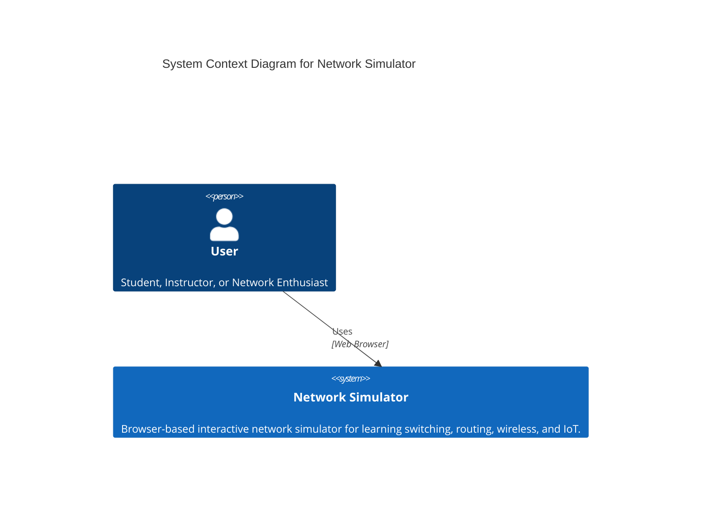
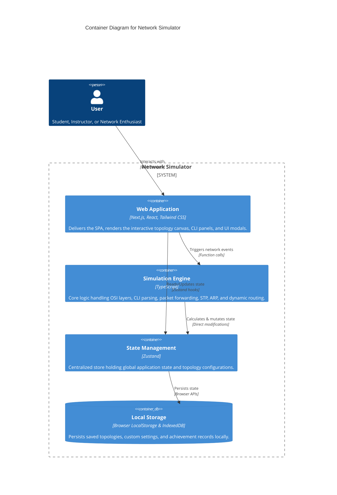

# NetworkSimulator — Tam Özellik Envanteri / Full Feature Inventory

## Türkçe (Turkish)

### 🖥️ Cihazlar ve Topoloji
- Router, L2/L3 Switch, PC, Firewall, Access Point, IoT cihazı, Wireless LAN Controller (WLC).
- Sürükle-bırak topoloji editörü, kablo çizme (masaüstü sürükleme + mobil tap-tap).
- Bağlantı uyumluluk kontrolü (geçersiz kablo bağlantısında uyarı).
- Port seçici modal, bağlantı hattı görselleştirme.
- Topoloji görselini PNG olarak dışa aktarma.
- Ortam arka planları (environment backgrounds).
- Spatial partitioning (100+ cihazda yüksek performans optimizasyonu).

### ⌨️ CLI / Terminal
- Gerçek IOS benzeri komut satırı (user, privileged, global-config, interface, line, vlan, router-config ve adlandırılmış-ACL modları).
- Tab tuşu ile otomatik komut tamamlama.
- Komut geçmişi (Yukarı/Aşağı ok tuşları, kalıcı state).
- Pipe filtreleme (`show run | include` vb.).
- Aktif moda göre değişen, mobil odaklı hızlı komut butonları.
- Renk kodlu gerçekçilik seviyesi göstergesi (`real` / `stub` / `sim-only`).
- Eğitici ve ipuçları içeren hata mesajları.

### 🌐 Protokoller
- VLAN, Trunk, STP (gerçek BPDU yayılımı).
- OSPF (multi-area destekli, gerçek Dijkstra SPF algoritması).
- EIGRP (DUAL motoru ve Feasibility Condition kontrolü).
- RIP ve RIPng yönlendirme protokolleri.
- HSRP ve VRRP yedeklilik protokolleri.
- BGP (Başlangıç düzey: neighbor remote-as, network, show ip bgp summary).
- ACL (standard + extended, gerçek zamanlı eşleşme sayıçları).
- NAT/PAT (static, dynamic ve overload/PAT desteği).
- DHCP sunucu ve istemci simülasyonu.
- Port Security (MAC kısıtlama, sticky MAC, ihlal eylemleri).
- DHCP Snooping (trusted/untrusted port, rate-limit, Option 82, VLAN kapsamlı).
- Dynamic ARP Inspection (ip arp inspection).
- IP Source Guard (ip verify source, ip source binding).
- SPAN Port Monitoring (monitor session, kaynak/hedef, rx/tx/both).
- EtherChannel: LACP (active/passive), PAgP (desirable/auto), static (on).
- Kablosuz Ağ (SSID, WPA şifreleme, AP ve WLC yönetimi).
- ARP, MAC öğrenme, TTL/Hop simülasyonu.
- PPP/HDLC WAN enkapsülasön, PAP/CHAP kimlik doğrulaması.
- SSH (v1/v2) ve Telnet oturum yönetimi.
- `switchport trunk allowed vlan add/remove/except/all` sözdizimi ile VLAN filtreleme.

### 📚 Eğitim Modülleri
- 19 Rehberli ders (Guided Mode) — adım adım yönergeler ve otomatik doğrulama; "Bana Öğret" modülü dahil.
- 46 Hazır örnek uygulama projesi ve sektörel senaryolar (SOHO, Kampüs, Hastane, E-Ticaret).
- 6 Sınav Modülü ve Öğretmenler için sınav editörü + otomatik puanlama.
- 3 seviyeli akıllı yardım sistemi (Başlangıç, Orta, Sınav).
- Ses sentezleyici ders anlatımı (Metin okuma - TTS).
- Fault Injection (Hata enjeksiyonu ve pratik arıza giderme motoru).
- Otomatik PDF sertifika üretimi (Türkçe karakter korumalı, 1 yıllık geçerlilik süresi ve doğrulama kodlu).

### 👩‍🏫 Sınıf Yönetimi (Room Sistemi)
- Öğretmen odaları (Redis tabanlı, katılım kodu ile bağlantı).
- Öğrencilerin ilerlemesini gerçek zamanlı izleme ve senkronizasyon.
- Öğretmen kontrol paneli (öğrenci ilerleme listesi, PDF raporlama).
- Sahiplik doğrulamalı öğretmen yetkilendirmesi.

### 🔍 Tanılama ve Görselleştirme
- Protokol Durum Paneli (canlı OSPF/STP/HSRP/EIGRP özeti).
- Paket Yakalama Paneli (Gelişmiş paket yakalama ve analizör arayüzü: canlı arama/filtreleme, virgül/boşluk ile çoklu dışlama (`cdp, stp, arp`), sayfalama, protokol numaraları gösterimi `STP (0x4242)`).
- Arka Plan Ağ Hareketliliği Yakalama (DHCP DORA `Discover/Offer/Request/ACK`, STP BPDU, CDP, OSPF Hello, RIP/EIGRP güncellemeleri ve WLAN Beacon paketlerinin otomatik kaydı).
- Ping animasyonu ve detaylı PDU inceleme paneli (hop-by-hop kontrol, P/N tuş kontrolü).
- Zaman Çizelgesi (Timeline) paneli ile geçmiş işlem takibi.
- `show interfaces` komutunda gerçek zamanlı rx/tx paket ve hata sayıçları.
- **Topoloji Üretici Sihirbazı** — 40+ hazır senaryo (VLAN, OSPF, EIGRP, NAT, IoT, Sorun Giderme vb.) arama ve üretme.

### 📱 Mobil / Tablet Desteği
- Sanal klavye açıldığında ekran kaymasını önleyen `visualViewport` düzeltmesi.
- Mobil cihazlar için alt sayfa (bottom sheet) menüsü.
- Tabletler için split-view bölünmüş ekran desteği (topoloji + terminal yan yana).
- Android cihazlar için sistem geri tuşu entegrasyonu.
- PWA desteği (offline önbellekleme, "Ana ekrana ekle" bildirimi).

### 🛡️ Güvenlik ve Altyapı
- API istekleri için Rate Limiting.
- Güvenli girdi sanitizasyonu ve XSS koruması.
- Şifreli LocalStorage (XOR + Base64) veri koruması.
- Sıkılaştırılmış Content Security Policy (CSP) başlıkları.
- CI sürecinde zorunlu `npm audit` güvenlik taraması.
- Sınav bütünlük kontrolü (XOR tabanlı veri bütünlük hash'i).

### 🧪 Test ve CI
- Vitest ile kapsamlı otomatik test senaryoları.
- Kapsamlı CI iş akışı: TypeScript tip doğrulaması, ESLint, npm audit, vitest testleri ve Next.js build kontrolü.
- Otomatik README istatistik güncelleyici.

### 📄 Dokümantasyon (23 dosya)
- CLI komut referansı, rehberli ders kılavuzları, hata yönetimi, entegrasyon kılavuzu, L3 switch konfigürasyonu, kablosuz ağlar, oda takip sistemi, kullanım kılavuzları ve örnek projelerin çözüm adımlarını barındıran Türkçe Eğitim Kitapçığı.

---

## English (English)

### 🖥️ Devices & Topology
- Router, L2/L3 Switch, PC, Firewall, Access Point, IoT device, Wireless LAN Controller (WLC).
- Drag-and-drop topology editor, cable drawing (desktop drag + mobile tap-tap).
- Cable compatibility checking (warnings on invalid cable connections).
- Port selector modal and cable connection line visualization.
- Export topology diagram as a PNG image.
- Custom environment backgrounds.
- Spatial partitioning (optimized high performance for 100+ devices).

### ⌨️ CLI / Terminal
- Realistic IOS-like command-line interface (user, privileged, global-config, interface, line, vlan, router-config, and named-ACL modes).
- Tab completion for command auto-suggest.
- Command history (Arrow Up/Down, persisted state).
- Pipe filtering (e.g., `show run | include`).
- Context-aware, mobile-focused quick command buttons.
- Color-coded command realism indicators (`real` / `stub` / `sim-only`).
- Educational error messages with helpful troubleshooting hints.

### 🌐 Protocols
- VLAN, Trunking, STP (real BPDU propagation).
- OSPF (multi-area support, real Dijkstra SPF routing).
- EIGRP (DUAL engine and Feasibility Condition validation).
- RIP and RIPng routing protocols.
- HSRP and VRRP redundancy protocols.
- BGP (basic: neighbor remote-as, network statements, show ip bgp summary).
- ACLs (standard + extended, real-time match counters).
- NAT/PAT (static, dynamic, and overload/PAT support).
- DHCP server and client simulation.
- Port Security (MAC limits, sticky MAC, violation actions).
- DHCP Snooping (trusted/untrusted ports, rate-limit, Option 82, VLAN-scoped).
- Dynamic ARP Inspection (ip arp inspection).
- IP Source Guard (ip verify source, ip source binding).
- SPAN Port Monitoring (monitor session, source/destination, rx/tx/both).
- EtherChannel: LACP (active/passive), PAgP (desirable/auto), static (on).
- Wireless Networking (SSID, WPA encryption, AP and WLC management).
- ARP, MAC learning, TTL/Hop simulation.
- PPP/HDLC WAN encapsulation with PAP/CHAP authentication.
- SSH (v1/v2) and Telnet session management.
- `switchport trunk allowed vlan add/remove/except/all` syntax for granular VLAN filtering.

### 📚 Education & Training
- 19 Guided Lessons — step-by-step instructions and automated verification, including "Teach Me" tracks.
- 46 pre-built example training labs and industry scenarios (SOHO, Campus, Hospital, E-Commerce).
- 6 Exam Modules and custom exam builder for instructors + automated grading.
- 3-tier intelligent help system (Beginner, Intermediate, Exam).
- Built-in Text-to-Speech (TTS) narration for guided lessons.
- Fault Injection (fault-injection and troubleshooting engine).
- Automated PDF Certificate generation (with Turkish character mapping, 1-year validity, and secure verification codes).

### 👩‍🏫 Classroom & Room Management
- Instructor Rooms (Redis-backed, code-based student join).
- Real-time student progress tracking and synchronization.
- Instructor dashboard (detailed progress overview, PDF exporting).
- Ownership-validated instructor authentication.

### 🔍 Diagnostics & Visualization
- Protocol Status Panel (live OSPF/STP/HSRP/EIGRP overview).
- Packet Capture Panel (Advanced packet capture and analyzer: real-time search/filtering, multi-term exclusion (`cdp, stp, arp`), pagination, protocol numbers `STP (0x4242)`).
- Background Network Activity Capture (automated capture of DHCP DORA `Discover/Offer/Request/ACK`, STP BPDU, CDP, OSPF Hello, RIP/EIGRP updates, and WLAN Beacons).
- Packet animation and comprehensive PDU inspect panels (hop-by-hop playback, P/N key control).
- Timeline Panel for past action logs and activity tracking.
- `show interfaces` displaying real-time rx/tx packet and error counters.
- **Topology Generator Wizard** — 40+ pre-built scenarios (VLAN, OSPF, EIGRP, NAT, IoT, Troubleshooting, etc.) with search.

### 📱 Mobile & Tablet Optimization
- `visualViewport` adjustment to prevent layout displacement by virtual keyboards.
- Bottom sheet menus for mobile device management.
- Split-view support for tablets (topology canvas and terminal side-by-side).
- Native Android back button integration.
- Full PWA support (offline caching, "Add to Home Screen" installation prompts).

### 🛡️ Security & Infrastructure
- Rate limiting for API endpoints.
- Secure input sanitization and XSS protection.
- Encrypted LocalStorage (XOR + Base64) storage protection.
- Hardened Content Security Policy (CSP) headers.
- Mandatory `npm audit` security scans in the CI pipeline.
- Exam integrity validation (XOR-based state signature hashing).

### 🧪 Testing & CI/CD
- Comprehensive automated test suite using Vitest.
- Complete CI/CD workflow: TypeScript validation, ESLint checks, npm audit, vitest, and Next.js production builds.
- Automated README statistics updater.

### 📄 Documentation (23 files)
- Comprehensive resources including CLI reference guides, guided lesson manuals, error handling logs, integration guides, L3 switch configurations, wireless guides, room tracking setups, user guides, and the Turkish Training Booklet containing walkthroughs for 46 labs.

## Architecture / Mimari

### C4 Architecture Diagrams

**1. System Context Diagram**


**2. Container Diagram**


### Directory Structure

```
src/
├── app/                  # Next.js App Router — pages & layouts
│   ├── api/             # API routes (contact, rooms, certificates)
│   ├── [id]/            # Dynamic routes
│   ├── layout.tsx       # Root layout
│   ├── page.tsx         # Home page
│   └── globals.css      # Global styles & design tokens
├── components/           # React components
│   ├── ui/              # Reusable UI (cards, dialogs, panels, inputs)
│   └── network/         # Network-specific (Terminal, Topology, PCPanel)
├── contexts/            # React contexts (theme, mode, language)
├── hooks/               # Custom React hooks
├── lib/
│   ├── design-tokens/  # Design tokens (colors, typography, spacing, animations)
│   ├── store/          # Zustand state management (appStore.ts)
│   ├── network/         # Network simulation engine
│   │   ├── core/        # CLI command implementations
│   │   ├── parser/      # CLI command parsers and patterns
│   │   └── exampleProjects.ts # Example project definitions
│   ├── security/        # Security utilities (sanitization, rate limiting)
│   ├── performance/     # Performance optimization (spatial partitioning)
│   └── storage/         # Storage utilities (window position management)
├── utils/               # Utilities (achievement records tracking)
└── tests/               # Unit, integration, accessibility and performance tests (Vitest)
```
