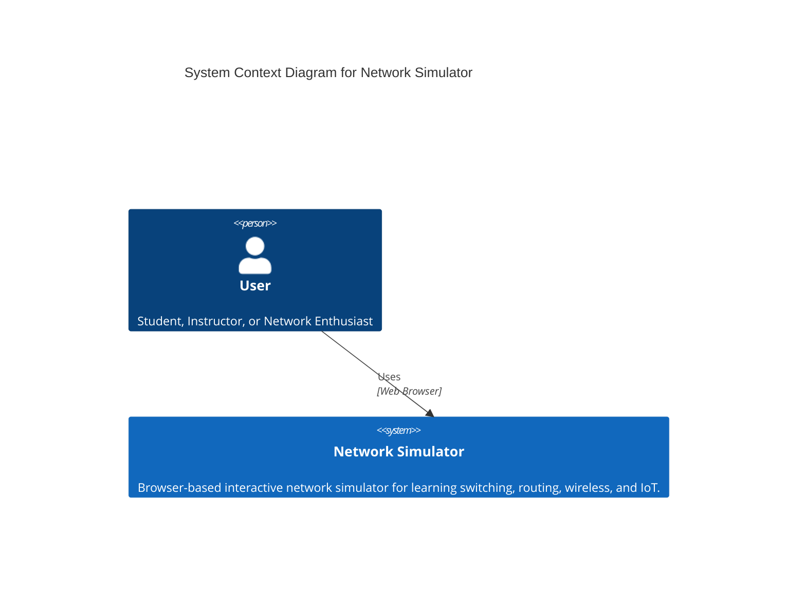
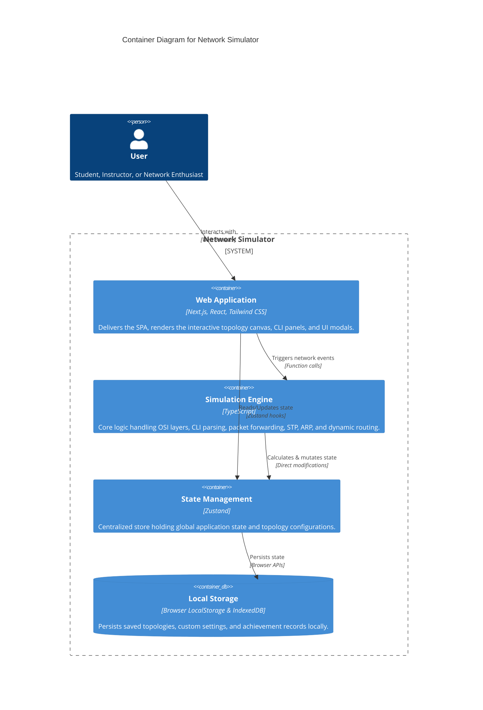

# NetworkSimulator — Tam Özellik Envanteri / Full Feature Inventory

## Son Ağ Simülasyonu Geliştirmeleri (2026-08-29)

- **IP SLA Active Probes:** Sentetik `icmp-echo` ve `jitter` prob gönderimi, RTT/jitter ölçümleri, timeout sayaçları ve `show ip sla statistics` çıktısı.
- **QoS Queue Scheduling:** WFQ, LLQ ve CBWFQ kuyruk algoritmaları; bant genişliği doygunluğunda paket düşürme ve sınıf bazlı istatistikler.
- Her iki özellik için otomatik birim testleri eklendi.

## Türkçe (Turkish)

### 🖥️ Cihazlar ve Topoloji
- Router, L2/L3 Switch, PC, Firewall, Access Point, IoT cihazı, Wireless LAN Controller (WLC).
- Sürükle-bırak topoloji editörü, kablo çizme (masaüstü sürükleme + mobil tap-tap).
- Bağlantı uyumluluk kontrolü (geçersiz kablo bağlantısında uyarı).
- Port seçici modal, bağlantı hattı görselleştirme.
- Topoloji görselini PNG olarak dışa aktarma.
- Ortam arka planları (environment backgrounds).
- Spatial partitioning (100+ cihazda yüksek performans optimizasyonu).

### ⌨️ CLI / Terminal
- Gerçekçi CLI komut satırı (user, privileged, global-config, interface, line, vlan, router-config ve adlandırılmış-ACL modları).
- PC CMD ve Dosya Düzenleyici ortamında tam kapsamlı **Python 3 yorumlayıcısı**:
  - **OOP:** Sınıflar (`class`), kurucu metot (`__init__`), nitelik bağlama (`self`), kalıtım (inheritance), `super()`, `isinstance()`.
  - **Decorator'lar:** `@property`, `@<name>.setter`, `@staticmethod`, `@classmethod` ve kullanıcı tanımlı decorator fonksiyonları.
  - **Generator'lar:** `yield` ve `yield from` ile tembel iterasyon (lazy evaluation).
  - **Modül Desteği:** `json`, `re` (regex), `os.path`, simüle edilmiş `socket` (ağ programlama betikleri için), `math`, `random`, `datetime`, `sys`.
  - **Güvenlik Katmanı:** Tarayıcı sandbox koruması ve dunder nitelik bloklaması.
- PC CMD'de kullanıcı tanımlı `.bat` ve `.cmd` yığın dosyaları çalıştırma (`@echo off`, `set`, `%VAR%`, `%1`, `goto`, `call`).
  - Dosya Düzenleyici (File Editor) pencerelerinde `Batch Yığın Dosyası` ve `Python Betiği` rozet etiketleri ile tek tıkla kaydedip CMD'de çalıştırma (Play).
  - **Linux Terminali (Bash kabuğu):** PC terminalinde tam bir Linux kabuğu; `ls -l`, `pwd`, `cd`, `cat`, `touch`, `mkdir`, `rm`, `cp`, `mv`, `chmod`, `chown`, `nano`/`vim` ile dosya sistemi yönetimi; `ifconfig`, `ip addr`, `ping`, `traceroute`, `nslookup`, `netstat`, `arp`, `ftp`, `ssh`, `telnet`, `curl`, `wget` ağ komutları; `whoami`, `hostname`, `uname -a`, `date`, `uptime`, `history`, `echo`, `sudo` sistem komutları. Komut dizimi: `for`/`while` döngüleri, `if` koşul blokları, shell değişkenleri (`$VAR`), boru hattı (`|`), çıktı yönlendirme (`>` ve `>>`), `grep` ve `wc` filtreleme; ayrıca `python3` ile Python betikleri çalıştırma.
  - Tab tuşu ile otomatik komut ve dosya tamamlama.
- Komut geçmişi (Yukarı/Aşağı ok tuşları, kalıcı state).
- Pipe filtreleme (`show run | include`, `ping | find` vb.).
- Aktif moda göre değişen, mobil odaklı hızlı komut butonları.
- Renk kodlu gerçekçilik seviyesi göstergesi (`real` / `stub` / `sim-only`).
- Eğitici ve ipuçları içeren hata mesajları.

### 🌐 Protokoller
- VLAN, Trunk, STP (gerçek BPDU yayılımı).
- OSPF (multi-area destekli, gerçek Dijkstra SPF algoritması).
- EIGRP (DUAL motoru ve Feasibility Condition kontrolü).
- RIP ve RIPng yönlendirme protokolleri.
- HSRP ve VRRP yedeklilik protokolleri.
- BGP (Dinamik komşuluk durumu: Established / Idle eşleşmesi, remote-as, show ip bgp summary, show ip bgp).
- ACL (standard + extended, gerçek zamanlı eşleşme sayaçları).
- NAT/PAT (static, dynamic ve overload/PAT desteği, port kolonlu show ip nat translations çıktısı).
- SLAAC (no ipv6 nd suppress-ra ile bağlı PC'lerde EUI-64 otomatik IPv6 adres üretimi).
- DHCP sunucu ve istemci simülasyonu.
- Port Security (MAC kısıtlama, sticky MAC, ihlal eylemleri).
- DHCP Snooping (trusted/untrusted port, rate-limit, Option 82, VLAN kapsamlı).
- Dynamic ARP Inspection (ip arp inspection).
- IP Source Guard (ip verify source, ip source binding).
- AAA (aaa new-model, RADIUS ve TACACS+ sunucu konfigürasyonu).
- SPAN Port Monitoring (monitor session, kaynak/hedef, rx/tx/both).
- EtherChannel: LACP (active/passive), PAgP (desirable/auto), static (on).
- Kablosuz Ağ (SSID, WPA şifreleme, AP ve WLC yönetimi).
- ARP, MAC öğrenme, TTL/Hop simülasyonu.
- PPP/HDLC WAN enkapsülasyonu, PAP/CHAP kimlik doğrulaması.
  - **SSH (v1/v2) ve Telnet oturum yönetimi (uçtan uca çalışır):** `crypto key generate rsa modulus 2048` → `ip ssh version 2` → `username <kullanıcı> privilege 15 secret <parola>` → `line vty 0 4` → `login local` → `transport input ssh` zinciri ile tam yapılandırma. PC terminalinden `ssh <kullanıcı>@<ip>` komutu başarılı bağlantıyı simüle eder: RSA/anahtar+SSH v2+login local+transport ssh kontrolleri yapılır, parola yerel kullanıcı veritabanına karşı doğrulanır ve oturum `sshSessions` içine `established` olarak yazılır (`show ssh` / `show ip ssh` ile görülebilir).
  - `switchport trunk allowed vlan add/remove/except/all` sözdizimi ile VLAN filtreleme.

### 🎓 CCNA 200-301 Müfredat Konuları Envanteri
- **Ağ Temelleri (Network Fundamentals):** IPv4/IPv6 Adresleme, Subnetting, VLSM, Link-Local IPv6 (`fe80::`), EUI-64 Host Adresi türetme, SLAAC (`no ipv6 nd suppress-ra`), Düz/Çapraz/Fiber/Seri kablolama.
- **Ağ Erişimi (Network Access / Switching):** VLANs (1-4094, 802.1Q, Native VLAN, Voice VLAN, Allowed VLAN listeleri), VTP v1/v2 (Server/Client/Transparent), STP / PVST+ / MSTP (802.1s — `spanning-tree mode mst`, `spanning-tree mst configuration`, instance-VLAN eşleme), EtherChannel (LACP/PAgP/Static), Port Security (Sticky MAC, Violation protect/restrict/shutdown), Kablosuz (WLC AIR-CT2504-K9, Lightweight AP, CAPWAP, WPA2/WPA3 PSK/Enterprise).
- **IP Bağlantısı (IP Connectivity / Routing):** Statik IPv4/IPv6 Yönlendirme (Default & Floating static routes), RIPv2 & RIPng (Split horizon, Passive interface, Auto-summary), OSPFv2 & OSPFv3 (Multi-area Area 0/10/20, Router-ID, ABR, NSSA/Stub, Passive-interface, Default-information originate, SPF Dijkstra), EIGRP (DUAL motoru, Feasibility Condition, AS, Router-ID, Auto-summary, Metrik hesabı), BGP (eBGP/iBGP, `router bgp <as>`, `neighbor <ip> remote-as <asn>`, dinamik `Established` / `Idle` komşuluk durumu, `show ip bgp summary`, `show ip bgp`), Rota Yeniden Dağıtımı (`redistribute ospf/rip/eigrp/bgp/static/connected`).
- **IP Servisleri (IP Services):** NAT / PAT (Statik NAT, Dinamik NAT, Overload / PAT, `show ip nat translations` port kolonları `Pro`, `Inside global:port`, `Inside local:port`, `Outside local:port`, `Outside global:port`, `show ip nat statistics`), SLAAC IPv6 (Router Advertisements `no ipv6 nd suppress-ra` ile otomatik adresleme), DHCP Sunucu & Relay (`ip dhcp pool`, `default-router`, `dns-server`, `excluded-address`, `ip helper-address`, IPv6 DHCP pool), FHRP (HSRPv1/v2 Active/Standby/Preempt, VRRP Master/Backup), QoS (MLS QoS, class-map, policy-map), Yönetim (Syslog level `logging trap`, SNMP, NTP, SSH v1/v2, Telnet, CDP/LLDP, SPAN, IP SLA).
- **Güvenlik Temelleri (Security Fundamentals):** ACLs (Standart 1-99, Genişletilmiş 100-199 IPv4 ACL'ler, IPv6 `ipv6 traffic-filter`), Katman 2 Güvenlik (DHCP Snooping, Dynamic ARP Inspection DAI, IP Source Guard), AAA & Kimlik Doğrulama (`aaa new-model`, RADIUS `radius-server host`, TACACS+ `tacacs-server host`), Kriptografi (`crypto key generate rsa`, `enable secret`, `service password-encryption`).

### 📚 Eğitim Modülleri
- 19 Rehberli ders (Guided Mode) — adım adım yönergeler ve otomatik doğrulama; "Bana Öğret" modülü dahil.
- 46 Hazır örnek uygulama projesi ve sektörel senaryolar (SOHO, Kampüs, Hastane, E-Ticaret).
- 6 Sınav Modülü ve Öğretmenler için sınav editörü + otomatik puanlama.
- 3 seviyeli akıllı yardım sistemi (Başlangıç, Orta, Sınav).
- Ses sentezleyici ders anlatımı (Metin okuma - TTS).
- Fault Injection (Hata enjeksiyonu ve pratik arıza giderme motoru).
  - Otomatik PDF sertifika üretimi (Türkçe karakter korumalı, 1 yıllık geçerlilik süresi ve doğrulama kodlu). Sertifikalar `http://network2026.vercel.app/verify` adresinden doğrulama kodu ile sorgulanabilir; PDF üzerinde QR kod ve doğrulama kodu yer alır.

### 📂 Proje Yönetimi
- **Yeni Başla (Yeni Proje):** Mevcut çalışmayı sıfırlayarak boş bir proje açar (varsayılan PC-1, PC-2, SWITCH-1). Önceki projeye ait tüm veriler — otomatik kayıt (`netsim_autosave`), geçmiş (`netsim_history`), pencere konumları, posta kutuları vb. — hem bellekten hem localStorage'dan tamamen temizlenir; böylece önceki proje hiçbir iz bırakmaz.
- Otomatik kayıt (autosave) ile açık proje düzenli olarak yerel olarak korunur.

### 👩‍🏫 Sınıf Yönetimi (Room Sistemi)
- Öğretmen odaları (Redis tabanlı, katılım kodu ile bağlantı).
- Öğrencilerin ilerlemesini gerçek zamanlı izleme ve senkronizasyon.
- Öğretmen kontrol paneli (öğrenci ilerleme listesi, PDF raporlama).
- Sahiplik doğrulamalı öğretmen yetkilendirmesi.

### 🔍 Tanılama ve Görselleştirme
- Protokol Durum Paneli (canlı OSPF/STP/HSRP/EIGRP özeti).
- Paket Yakalama Paneli (Gelişmiş paket yakalama ve analizör arayüzü: canlı arama/filtreleme, virgül/boşluk ile çoklu dışlama (`cdp, stp, arp`), sayfalama, protokol numaraları gösterimi `STP (0x4242)`).
- Arka Plan Ağ Hareketliliği Yakalama (DHCP DORA `Discover/Offer/Request/ACK`, STP BPDU, CDP, OSPF Hello, RIP/EIGRP güncellemeleri ve WLAN Beacon paketlerinin otomatik kaydı).
- Ping animasyonu ve detaylı PDU inceleme paneli (hop-by-hop kontrol, P/N tuş kontrolü).
- Zaman Çizelgesi (Timeline) paneli ile geçmiş işlem takibi.
- `show interfaces` komutunda gerçek zamanlı rx/tx paket ve hata sayıçları.
  - **Topoloji Üretici Sihirbazı** — 40+ hazır senaryo (VLAN, OSPF, EIGRP, NAT, IoT, Sorun Giderme vb.) arama ve üretme.
  - **Subnetting Yardımcısı (etkileşimli panel):** IP adresi ve subnet maskesi (hem ondalık `255.255.255.0` hem de CIDR `/24` ön eki) girildiğinde ağ (network), broadcast, ilk/son kullanılabilir host, kullanılabilir host sayısı, toplam adres ve wildcard mask değerlerini anlık olarak hesaplayıp gösteren panel (PC → Ayarlar sekmesi). Ayrıca `show ip interface brief` çıktısı her IP'li interface için `Subnet: <ağ>/<prefix>  Broadcast: <broadcast>  Hosts: <ilk>-<son> (<sayı>)` satırını içerir.

### 📱 Mobil / Tablet Desteği
- Sanal klavye açıldığında ekran kaymasını önleyen `visualViewport` düzeltmesi.
- Mobil cihazlar için alt sayfa (bottom sheet) menüsü.
- Tabletler için split-view bölünmüş ekran desteği (topoloji + terminal yan yana).
- Android cihazlar için sistem geri tuşu entegrasyonu.
- PWA desteği (offline önbellekleme, "Ana ekrana ekle" bildirimi).

### 🛡️ Güvenlik ve Altyapı
- API istekleri için Rate Limiting.
- Güvenli girdi sanitizasyonu ve XSS koruması.
- Şifreli LocalStorage (XOR + Base64) veri koruması.
- Sıkılaştırılmış Content Security Policy (CSP) başlıkları.
- CI sürecinde zorunlu `npm audit` güvenlik taraması.
- Sınav bütünlük kontrolü (XOR tabanlı veri bütünlük hash'i).

### 🧪 Test ve CI
- Vitest ile kapsamlı otomatik test senaryoları.
- Kapsamlı CI iş akışı: TypeScript tip doğrulaması, ESLint, npm audit, vitest testleri ve Next.js build kontrolü.
- Otomatik README istatistik güncelleyici.

### 📄 Dokümantasyon (23 dosya)
- CLI komut referansı, rehberli ders kılavuzları, hata yönetimi, entegrasyon kılavuzu, L3 switch konfigürasyonu, kablosuz ağlar, oda takip sistemi, kullanım kılavuzları ve örnek projelerin çözüm adımlarını barındıran Türkçe Eğitim Kitapçığı.

---

## English (English)

### 🖥️ Devices & Topology
- Router, L2/L3 Switch, PC, Firewall, Access Point, IoT device, Wireless LAN Controller (WLC).
- Drag-and-drop topology editor, cable drawing (desktop drag + mobile tap-tap).
- Cable compatibility checking (warnings on invalid cable connections).
- Port selector modal and cable connection line visualization.
- Export topology diagram as a PNG image.
- Custom environment backgrounds.
- Spatial partitioning (optimized high performance for 100+ devices).

### ⌨️ CLI / Terminal
- Realistic CLI command-line interface (user, privileged, global-config, interface, line, vlan, router-config, and named-ACL modes).
- Tab completion for command auto-suggest.
- Command history (Arrow Up/Down, persisted state).
- Pipe filtering (e.g., `show run | include`).
- Context-aware, mobile-focused quick command buttons.
- Color-coded command realism indicators (`real` / `stub` / `sim-only`).
  - Educational error messages with helpful troubleshooting hints.
  - **Linux Terminal (Bash shell):** a full Linux shell inside the PC terminal — file-system management with `ls -l`, `pwd`, `cd`, `cat`, `touch`, `mkdir`, `rm`, `cp`, `mv`, `chmod`, `chown`, `nano`/`vim`; networking with `ifconfig`, `ip addr`, `ping`, `traceroute`, `nslookup`, `netstat`, `arp`, `ftp`, `ssh`, `telnet`, `curl`, `wget`; system commands `whoami`, `hostname`, `uname -a`, `date`, `uptime`, `history`, `echo`, `sudo`. Scripting supports `for`/`while` loops, `if` conditionals, shell variables (`$VAR`), pipes (`|`), output redirection (`>` and `>>`), and `grep`/`wc` filtering; `python3` scripts can also be run.

### 🌐 Protocols
- VLAN, Trunking, STP (real BPDU propagation).
- OSPF (multi-area support, real Dijkstra SPF routing).
- EIGRP (DUAL engine and Feasibility Condition validation).
- RIP and RIPng routing protocols.
- HSRP and VRRP redundancy protocols.
- BGP (Dynamic neighbor state matching Established/Idle, remote-as, show ip bgp summary, show ip bgp).
- ACLs (standard + extended, real-time match counters).
- NAT/PAT (static, dynamic, overload/PAT, and port-column formatted show ip nat translations output).
- SLAAC (IPv6 Router Advertisements `no ipv6 nd suppress-ra` for automatic host EUI-64 address generation).
- DHCP server and client simulation.
- Port Security (MAC limits, sticky MAC, violation actions).
- DHCP Snooping (trusted/untrusted ports, rate-limit, Option 82, VLAN-scoped).
- Dynamic ARP Inspection (ip arp inspection).
- IP Source Guard (ip verify source, ip source binding).
- AAA (aaa new-model, RADIUS & TACACS+ server configuration).
- SPAN Port Monitoring (monitor session, source/destination, rx/tx/both).
- EtherChannel: LACP (active/passive), PAgP (desirable/auto), static (on).
- Wireless Networking (SSID, WPA encryption, AP and WLC management).
- ARP, MAC learning, TTL/Hop simulation.
- PPP/HDLC WAN encapsulation with PAP/CHAP authentication.
  - **SSH (v1/v2) and Telnet session management (end-to-end):** the full chain `crypto key generate rsa modulus 2048` → `ip ssh version 2` → `username <user> privilege 15 secret <pw>` → `line vty 0 4` → `login local` → `transport input ssh` fully configures SSH. From a PC terminal, `ssh <user>@<ip>` simulates a successful connection: it verifies RSA keys + SSH v2 + login local + transport ssh, authenticates the password against the local user database, and records the session as `established` in `sshSessions` (visible via `show ssh` / `show ip ssh`).
  - `switchport trunk allowed vlan add/remove/except/all` syntax for granular VLAN filtering.

### 🎓 CCNA 200-301 Curriculum & Protocol Inventory
- **Network Fundamentals:** IPv4/IPv6 Addressing, Subnetting, VLSM, Link-Local IPv6 (`fe80::`), EUI-64 Host Address derivation, SLAAC (`no ipv6 nd suppress-ra`), Straight-through/Crossover/Fiber/Serial cabling.
- **Network Access / Switching:** VLANs (1-4094, 802.1Q, Native VLAN, Voice VLAN, Trunk allowed VLAN lists), VTP v1/v2 (Server/Client/Transparent), STP / PVST+ / MSTP (802.1s — `spanning-tree mode mst`, `spanning-tree mst configuration`, instance-VLAN mapping), EtherChannel (LACP/PAgP/Static), Port Security (Sticky MAC, Violation protect/restrict/shutdown), Wireless (WLC AIR-CT2504-K9, Lightweight AP, CAPWAP, WPA2/WPA3 PSK/Enterprise).
- **IP Connectivity / Routing:** Static IPv4/IPv6 Routing (Default & Floating static routes), RIPv2 & RIPng (Split horizon, Passive interface, Auto-summary), OSPFv2 & OSPFv3 (Multi-area Area 0/10/20, Router-ID, ABR, NSSA/Stub, Passive-interface, Default-information originate, SPF Dijkstra), EIGRP (DUAL engine, Feasibility Condition, AS, Router-ID, Auto-summary, Metric calculation), BGP (eBGP/iBGP, `router bgp <as>`, `neighbor <ip> remote-as <asn>`, dynamic `Established` / `Idle` neighbor state, `show ip bgp summary`, `show ip bgp`), Route Redistribution (`redistribute ospf/rip/eigrp/bgp/static/connected`).
- **IP Services:** NAT / PAT (Static NAT, Dynamic NAT, Overload / PAT, `show ip nat translations` port columns `Pro`, `Inside global:port`, `Inside local:port`, `Outside local:port`, `Outside global:port`, `show ip nat statistics`), SLAAC IPv6 (Router Advertisements `no ipv6 nd suppress-ra` for automatic host EUI-64 address generation), DHCP Server & Relay (`ip dhcp pool`, `default-router`, `dns-server`, `excluded-address`, `ip helper-address`, IPv6 DHCP pool), FHRP (HSRPv1/v2 Active/Standby/Preempt, VRRP Master/Backup), QoS (MLS QoS, class-map, policy-map), Management (Syslog level `logging trap`, SNMP, NTP, SSH v1/v2, Telnet, CDP/LLDP, SPAN, IP SLA).
- **Security Fundamentals:** ACLs (Standard 1-99, Extended 100-199 IPv4 ACLs, IPv6 `ipv6 traffic-filter`), Layer 2 Security (DHCP Snooping, Dynamic ARP Inspection DAI, IP Source Guard), AAA & Authentication (`aaa new-model`, RADIUS `radius-server host`, TACACS+ `tacacs-server host`), Cryptography (`crypto key generate rsa`, `enable secret`, `service password-encryption`).

### 📚 Education & Training
- 19 Guided Lessons — step-by-step instructions and automated verification, including "Teach Me" tracks.
- 46 pre-built example training labs and industry scenarios (SOHO, Campus, Hospital, E-Commerce).
- 6 Exam Modules and custom exam builder for instructors + automated grading.
- 3-tier intelligent help system (Beginner, Intermediate, Exam).
- Built-in Text-to-Speech (TTS) narration for guided lessons.
- Fault Injection (fault-injection and troubleshooting engine).
  - Automated PDF Certificate generation (with Turkish character mapping, 1-year validity, and secure verification codes). Certificates can be verified by entering the verification code at `http://network2026.vercel.app/verify`; the PDF includes a QR code and the verification code.

### 📂 Project Management
- **New Project / Start Fresh ("Yeni Başla"):** resets the current work and opens a blank project (default PC-1, PC-2, SWITCH-1). All data from the previous project — autosave (`netsim_autosave`), history (`netsim_history`), window positions, mailboxes, etc. — is fully cleared from both memory and localStorage, leaving no trace of the prior project.
- Autosave periodically persists the open project locally.

### 👩‍🏫 Classroom & Room Management
- Instructor Rooms (Redis-backed, code-based student join).
- Real-time student progress tracking and synchronization.
- Instructor dashboard (detailed progress overview, PDF exporting).
- Ownership-validated instructor authentication.

### 🔍 Diagnostics & Visualization
- Protocol Status Panel (live OSPF/STP/HSRP/EIGRP overview).
- Packet Capture Panel (Advanced packet capture and analyzer: real-time search/filtering, multi-term exclusion (`cdp, stp, arp`), pagination, protocol numbers `STP (0x4242)`).
- Background Network Activity Capture (automated capture of DHCP DORA `Discover/Offer/Request/ACK`, STP BPDU, CDP, OSPF Hello, RIP/EIGRP updates, and WLAN Beacons).
- Packet animation and comprehensive PDU inspect panels (hop-by-hop playback, P/N key control).
- Timeline Panel for past action logs and activity tracking.
- `show interfaces` displaying real-time rx/tx packet and error counters.
  - **Topology Generator Wizard** — 40+ pre-built scenarios (VLAN, OSPF, EIGRP, NAT, IoT, Troubleshooting, etc.) with search.
  - **Subnetting Helper (interactive panel):** enter an IP address and subnet mask (decimal `255.255.255.0` or CIDR `/24` prefix) and the panel instantly computes network, broadcast, first/last usable host, usable host count, total addresses and wildcard mask (PC → Settings tab). In addition, `show ip interface brief` prints a `Subnet: <net>/<prefix>  Broadcast: <broadcast>  Hosts: <first>-<last> (<count>)` line for every interface that has an IP.

### 📱 Mobile & Tablet Optimization
- `visualViewport` adjustment to prevent layout displacement by virtual keyboards.
- Bottom sheet menus for mobile device management.
- Split-view support for tablets (topology canvas and terminal side-by-side).
- Native Android back button integration.
- Full PWA support (offline caching, "Add to Home Screen" installation prompts).

### 🛡️ Security & Infrastructure
- Rate limiting for API endpoints.
- Secure input sanitization and XSS protection.
- Encrypted LocalStorage (XOR + Base64) storage protection.
- Hardened Content Security Policy (CSP) headers.
- Mandatory `npm audit` security scans in the CI pipeline.
- Exam integrity validation (XOR-based state signature hashing).

### 🧪 Testing & CI/CD
- Comprehensive automated test suite using Vitest.
- Complete CI/CD workflow: TypeScript validation, ESLint checks, npm audit, vitest, and Next.js production builds.
- Automated README statistics updater.

### 📄 Documentation (23 files)
- Comprehensive resources including CLI reference guides, guided lesson manuals, error handling logs, integration guides, L3 switch configurations, wireless guides, room tracking setups, user guides, and the Turkish Training Booklet containing walkthroughs for 46 labs.

## Architecture / Mimari

### C4 Architecture Diagrams

**1. System Context Diagram**


**2. Container Diagram**


### Directory Structure

```
src/
├── app/                  # Next.js App Router — pages & layouts
│   ├── api/             # API routes (contact, rooms, certificates)
│   ├── [id]/            # Dynamic routes
│   ├── layout.tsx       # Root layout
│   ├── page.tsx         # Home page
│   └── globals.css      # Global styles & design tokens
├── components/           # React components
│   ├── ui/              # Reusable UI (cards, dialogs, panels, inputs)
│   └── network/         # Network-specific (Terminal, Topology, PCPanel)
├── contexts/            # React contexts (theme, mode, language)
├── hooks/               # Custom React hooks
├── lib/
│   ├── design-tokens/  # Design tokens (colors, typography, spacing, animations)
│   ├── store/          # Zustand state management (appStore.ts)
│   ├── network/         # Network simulation engine
│   │   ├── core/        # CLI command implementations
│   │   ├── parser/      # CLI command parsers and patterns
│   │   └── exampleProjects.ts # Example project definitions
│   ├── security/        # Security utilities (sanitization, rate limiting)
│   ├── performance/     # Performance optimization (spatial partitioning)
│   └── storage/         # Storage utilities (window position management)
├── utils/               # Utilities (achievement records tracking)
└── tests/               # Unit, integration, accessibility and performance tests (Vitest)
```

---

## 🧪 Örnekler (Examples)

### Örnek 1 — SSH Tam Akışı (Başarılı Bağlantı Simülasyonu)

**Hedef:** Router'ı SSH ile güvenli yönetime açmak ve PC'den başarılı bir SSH oturumu başlatmak.

**Topoloji:** 1 Router (R1) + 1 PC (PC-1), `PC-1 Eth0 → R1 Gi0/0` (düz kablo).

**R1 CLI komut zinciri:**
```
R1> enable
R1# configure terminal
R1(config)# hostname R1
R1(config)# ip domain-name lab.local
R1(config)# crypto key generate rsa modulus 2048
R1(config)# ip ssh version 2
R1(config)# username admin privilege 15 secret 1234
R1(config)# enable secret 123
R1(config)# line vty 0 4
R1(config-line)# login local
R1(config-line)# transport input ssh
R1(config-line)# exit
R1(config)# interface gi0/0
R1(config-if)# ip address 192.168.1.150 255.255.255.0
R1(config-if)# no shutdown
```

**PC-1 ayarları:** IP `192.168.1.10`, Subnet `255.255.255.0`, Gateway `192.168.1.150`.

**PC-1 CMD — başarılı SSH bağlantısı:**
```
C:\> ssh admin@192.168.1.150
Password: 1234
R1>
```
Bağlantı sonrası R1 üzerinde:
```
R1# show ssh
... Active SSH Sessions: 1
Session   User       Source
1         admin      vty0

R1# show ip ssh
SSH Version: 2
SSH Status: enabled
VTY Transport Input: ssh
```

### Örnek 2 — Subnetting Yardımcısı

**Nerede:** PC → Ayarlar (Settings) sekmesi → "Subnetting Yardımcısı" paneli.

**Girdi:** IP `192.168.1.10`, Subnet Mask `255.255.255.0` (veya `/24`).

**Çıktı:**
| Alan | Değer |
|------|-------|
| Ağ (Network) | `192.168.1.0/24` |
| Broadcast | `192.168.1.255` |
| İlk kullanılabilir host | `192.168.1.1` |
| Son kullanılabilir host | `192.168.1.254` |
| Kullanılabilir host sayısı | `254` |
| Toplam adres | `256` |
| Wildcard mask | `0.0.0.255` |
| Subnet mask | `255.255.255.0` |

**`show ip interface brief` (CLI) ek bilgisi:**
```
Interface              IP-Address      OK? Method Status                Protocol
Gi0/0                  192.168.1.150   YES manual up                    up
  Subnet: 192.168.1.0/24  Broadcast: 192.168.1.255  Hosts: 192.168.1.1-192.168.1.254 (254)
```

> Daha fazla uçtan uca laboratuvar örneği için: `doc/training/ORNEK_LABLAR.md`

